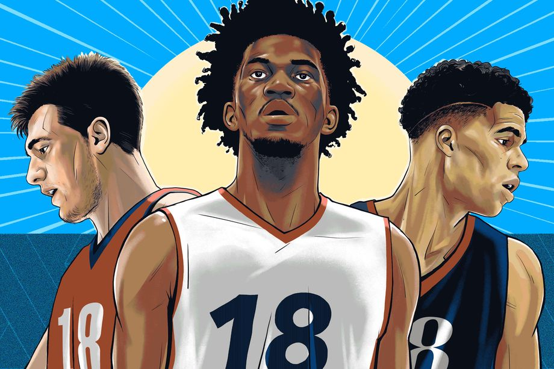

# NBA 2018 Draft Pick Hypothesis

<b>No. 1 Phoenix Suns:</b>

DeAndre Ayton is a physical specimen and generational Centre. Think of David Robinson strength, mobility and fluidity. Not close to the defensive player he was but has the potential to be very effective. Fits in the new age Centre with the ability to hit the outside shot. Defensive awareness need to improve to be a dominant two-way player and tends to have similar LeBron energy preserving technique on the defensive end.

With the rookie scale contract ending for Alex Len and Elfrid Payton. Roughly $53 million is tied up to Brandon Knight, Tyson Chandler and Jared Dudley for the next one to two years. The Phoenix Suns have are in a unique position to add a generational piece to their franchise. Devin Booker, Josh Jackson, Marquise Chris, TJ Warren and Dragan Bender form their promising core. After adding Ayton, the only hole left would be at Point Guard. The Suns are definitely a team to watch out for.

<b>No. 2 Sacramento Kings:</b>

Marvin Bagley is a very fluid athletic big. A stronger, less lengthy Chris Bosh without the jump shot. Has the potential to be a stretch four/five. Raw prospect and is a high boom-bust candidate. NBA ready body and athleticism will help offset the problems many rookies face in their first season.

Sacramento needs as much talent it can gather. Can pick from Marvin, Mo or Jaren at number 2 with Doncic as the dark horse. Any of the players named would be a fine selection. Ultimately, I believe they choose Bagley over the other three as they have their franchise Point Guard in De’Aaron Fox, potential double-double machine at Centre in Willie Cauley-Stein, and solid young pieces in Bogdanovic, Jackson, Giles, Labissiere and Buddy Hield. Before the ACL injury, former Duke alumni Harry Giles essentially Chris Webber. If Giles can’t regain his athleticism back, Bagley would be an excellent replacement.

<b>No. 3 Atlanta Hawks:</b>

First thing that stands out about Mohamed Bamba is his 7’9” Wingspan – which would be the largest in the NBA with Rudy Gobert trailing behind. Not an explosive athlete like Ayton or Bagley, but projects to be an elite rim protector while stretching the floor and hit the outside shot.

With Dennis Schroder desire to play on a competitive team, the Atlanta Hawks are in for some trouble. With no bonifide up-and-coming superstar they lack the talent to be competitive for the next few years. Rookie John Collins played exceptionally well and the emergence of Taurean Prince is a nice piece on the wing. Mo Bamba would fill in nicely at Centre and the trade of Schroder for draft picks or young pieces would expedite their rebuilding stage.

<b>No. 4 Memphis Grizzlies:</b>

Like Bagley, Jaren is a smooth athletic big man but with a 7’4” wingspan. At this stage, Jaren is better than Bagley on putting the ball on the floor thanks to the threat of his jump shot. Higher defensive ceiling than Bagley. But at this stage, Jackson is similiarly a raw overall player.

Grit and Grind Memphis Grizzlies have aged. With the NBA going for space and pace, they are going obsolete. Roughly $197 million is tied between Conley, Parsons and Gasol in the next two-three years (player option and early termination option included). They need to hit on their next few draft picks to stay relevant. They have nice big prospects in Deyonta Davis, Jarell Martin and Ivan Rabb. With the uncertainty of Michael Porter’s spine and Doncic's mystique they can't afford to bust on this pick. Jackson Jr. is the best talent available.

<b>No. 5 Dallas Mavericks:</b>

No one aside from Ayton has as much potential as Michael Porter Jr. His size, athleticism and skill compare to a less lengthy Kevin Durant. The spinal injury occurred in the first few minutes of his college career might cause him to slip down the draft. His body fat percentage remained low (recorded at the combine). Hopefully he regains his athleticism and the spine isn’t a problem in the future as Michael Porter Jr. is a special player to watch out for.

The Dirk Nowitzki era will be coming to an end sooner rather than later. The Mavericks are in rebuild mode with Rick Carlisle at the helm. They hit a home run with last years pick in Dennis Smith at number 9. Smith who I was and still very high on, will be the point guard of the future - Westbrook explosiveness (doesn’t have the top speed) with the poise and demeanour of Damian Lillard (Can get hot headed at times). Mavericks can opt for Doncic, as they have been very successful with going the European route. But the potential Porter Jr. has can’t be passed on. 