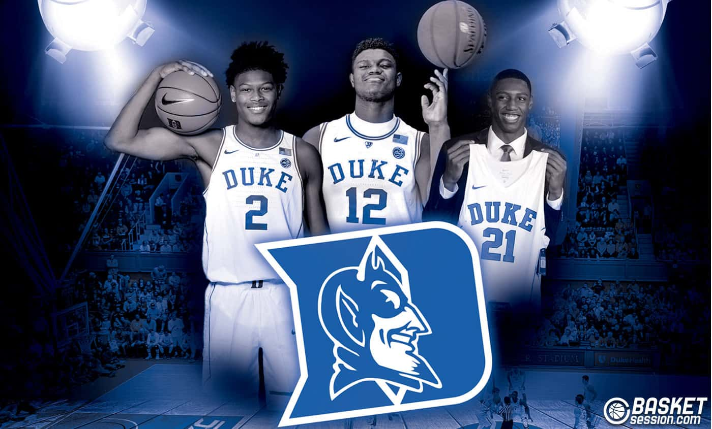

# 2018 Duke Canada Tour

<b>R.J Barrett</b>

<i>Game 1 Vs. Ryerson Rams: 34 Points, 12-30, 8-14 ft, 2-8 3pt, 5 Rebounds, 2 Assists, 1 Block, 1 Steal, 5 Turnovers, 35 Min

Game 2 Vs. University of Toronto Varsity Blues: 35 Points, 15-26 fg, 2-5 ft, 3-8 3pt, 9 Rebounds, 3 Assists, 0 Blocks, 1 Steal, 4 Turnover, 31 Min

Game 3 Vs. McGill Redmen: 23 Points, 8-16 fg, 6-11 ft, 1-5 3pt, 5 Rebounds, 10 Assists, 0 Blocks, 0 Steals, 3 Turnovers, 29 Min</i>

After a highly decorated high school career, the hometown kid R.J. Barrett returns home to Mississauga. The Duke Blue Devils take on Ryerson Rams for the first game of the Canadian Tour.

Nerves are expected for any player who plays in front of family in their hometown. But after a few minutes the jitters are gone and many see why he was the number one ranked high school prospect (by ESPN) and projected to go first overall in next year’s draft.

Already having an NBA body and above average NBA athleticism, R.J., also has a polished game. A weird mixture of fluid and robotic movements, he uses screens exceptionally well to get off his mid range shots. This was seen when he dominated u19 team USA for 38 points and the win. And also during his time with the Senior Men’s Canadian National team this summer.

Already has spot up NBA 3 point range, however shooting should be the number one priority for improvement. Potential to be a plus defender in the NBA as he is built strong, quick and athletic with a 6”10 wingspan (last measured by draft express in 2017). Still needs to improve on angling against defenders and improve his pick and roll defense against higher level competition.

Tightening his handle would be another area for improvement, as he can’t rely on his athleticism alone at the next level. Free throws were an issue during the Canada Tour but I do see R.J. potentially shooting 77-84%. Underrated in off ball situations and is good at using screens as mentioned above or cutting baseline. He has intriguing potential as a playmaker due to his aggressive yet unselfish nature.

Has a high motor and hard worker with a phenomenal support system, as his Dad is Rowan Barrett and Godfather is Steve Nash. With that said, R.J. not only has the talent to go number one is the 2019 NBA Draft -but, also the potential to be a perennial all-star for years to come.

<b>Zion Williamson</b>

<i>Game 1 Vs. Ryerson Rams: 29 Points, 13-23 fg, 0-1 ft, 3-4 3pt, 13 Rebounds, 4 Assists, 2 Blocks, 2 Steals, 0 Turnovers, 33 Min

Game 2 Vs. University of Toronto Varsity Blues: 24 Points, 12-16 fg, 0-1 ft, 0-2 3pt, 8 Rebounds, 2 Assists, 1 Block, 2 Steals, 4 Turnovers, 30 Min

Game 3 Vs. McGill Redmen: 36 Points, 15-23 fg, 6-10, 0-3 3pt, 13 Rebounds, 4 Assists, 2 Blocks, 2 Steals, 4 Turnovers, 31 Min</i>

Not as decorated as R.J. in high school, but his unreal dunks have gone viral and almost every basketball player has heard of Zion. He again made headlines this summer breaking Duke’s vertical jump record but also measuring at 6”7 and 285 lbs.

Using the eye test Zion is built like a NFL defensive end – he even rivals LeBron in terms of sheer size and build. Not only massive, Zion is extremely athletic and that showed right away against the three Canadian University teams. The Canadian teams in their own right are very good. McGill Redmen finished fourth. While Ryerson finished second in the finals losing by two, and also beat Canadian dynasty Carleton Ravens in the semi-finals (who in their own right beat a lot of mid to high major D1 NCAA teams in the past).

All of that didn’t seem to matter as Zion who just turned eighteen this July made all of the Canadian teams (which mainly play upperclassmen) look like high school players. Most of his points came within the paint and was unstoppable, as he would finish with finesse or many times with NBA Street type dunks. Although he shot a combined two free throws in the first two games, which would be concerning elite level talent. The defense was not at the level he would face this coming season or in the NBA. As this is evident in the final scores, Duke won each game by a disrespectful margin.

Potential as a defender is a bit trickier than Barrett. He is active in the passing lanes and is a better weak side blocker than rim protector like Rudy Gobert. The question is if he can defend quick, lengthy small forwards or taller power forwards in the NBA. I believe it is on a matchup basis. He will start off at the three and playing the important role of “small” ball four, before transferring to the four spot permanently later in his career.

Like R.J., Zion should always look to improve his ability to shoot in all facets of the game. Spot up, Catch and shoot, off the dribble, expanded range to NBA 3 point line. He is also a very underrated playmaker as he pairs his aggressive play style to his unselfish demeanour. Off the court he is like any teenager and gets along with teammates. This can be seen on Duke’s official YouTube page, covered by Duke Blue Planet.

Overall if Zion can remain healthy (especially with his lower back, knees and feet) and expand his game, he could turn out to be a matchup nightmare and NBA Dunk Contest champion.

<b>Extra Notes</b>

*Cam Reddish(Rank 3 ESPN) & Tre Jones(Rank 17 ESPN) were out due to injury 
**Canadian College/University 3 point line is equvilant to international/FIBA

