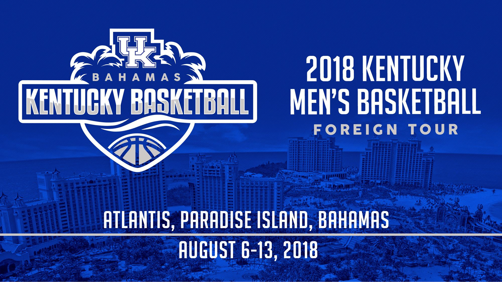

# 2018 Kentucky Wildcats Bahamas Foreign Tour

Big Blue Nation once again is locked and loaded for another year. Although Kentucky lost Kevin Knox, Shai Gilgeous-Alexander, Jarred Vanderbilt and Hamidou Diallo, they replace them with a stacked recruiting class only trailing Duke. With three returning key players, transfer graduate and this years second best recruiting class, I’ll examine what could be in store for the Kentucky Wildcats.

<i>Game 1 Vs. Bahamas National Team: 85-61 W

Game 2 Vs. San Lorenzo de Almagro: 91-68 W

Game 3 Vs. Mega Bemax: 100-64 W

Game 4 Vs. Team Toronto: 93-60 W</i>

<b>Guards:</b>

John Calipari isn’t a stranger to strong guard play. From Derrick Rose and Tyreke Evans in Memphis to Kentucky’s start of a dynasty with John Wall and Eric Bledsoe. Other notables are Brandon Knight, Marquis Teague, Archie Goodwin, Harrison Twins, Devin Booker, Tyler Ulis, Jamal Murray, De’Aaron Fox and Malik Monk.

Returning sophomore and former five star recruit Quade Green. Kentucky looks to leadership at guard from him, as he is relentless and hard worker. Better suited off ball on offense, as he is an improving shooter and a very capable second ball handler/playmaker. After an abysmal shooting performance in the first game against the Bahamas National Team. Quade shot the ball extremely well, combine shooting for 14/19 field goals and 4/6 from three.

Ashton Hagans is the best defensive guard on the team. Very aggressive with quick hands and good instincts on passing lanes, leads to many steals. Can rack up assists but is turnover prone. Not great at running the team and is better suited as a change of pace guard at this stage of his basketball development. Doesn’t dominate the game by scoring but is an excellent rebounder at the guard position. Should continue to improve his shooting and be a key member of the backcourt.

Immanuel Quickley projects to be the best pro out of the trio. Struggled to shoot from the perimeter during the trip but has potential to score from all three levels - paint, mid range, three point. Decent defender due to his size and length at guard, can also grab boards and set up teammates for easy baskets. Decent at running the team and should be a better shooter as the season progresses. Quickley will be vital to this teams success in the tournament.

<b>Forwards:</b>

First thing that pops out about Keldon Johnson is his athleticism and strength. He is a mixture of Hamidou Diallo but less explosive leaping ability and Miles Bridges with less strength. Keldon is very fluid, and projects to be a great 3&D player with a chance to develop some sort of shot creation at the next level. After shooting a terrible 3-15 field goal in the first game, he was efficient afterwards. Combined to through the last three games shot 18/25 field goal and 4/7 from three.

Tyler Herro is a walking bucket. Interchangeable at the two or three, he can score from all three levels, is fearlessly and does not lack any confidence. Scores within the offense, but sometimes forces the issue. Usually isn’t a concern for a player’s development at this stage. But his aggressive demeanour is because he plays with a chip on his shoulder and has something to prove. Defensively he gives maximum effort but should improve on his later quickness and angle defenders better. Underrated run jump athlete and should score many buckets this year and in the future.

This team’s version of Draymond Green, P.J. Washington does it all for the Kentucky Wildcats. Defensively active hands lead to steals and blocks, can find the open man for assists and clean the glass for boards. Doesn’t have the vision or passing accuracy of Draymond but is a threat to be a playmaker. Aggressive on the boards and looking to expand his offensive game by shooting the three, P.J. has improved immensely no longer looking lost at times. Free throws is still an issue for improvement on as he will be a key cog in the frontcourt.

Stanford transfer graduate Travis Reid is a man. NBA/grown man strength improves the Wildcats interior defense. Won’t be an offensive force like Embiid or Towns but has a very quick spin move or left shoulder turn around right hand layup to get easy baskets. However main purpose is to impose his strength and clean the boards for Kentucky.

<b>Centers:</b>

Out of the three Wildcats returning Nicki Richards has improved the most. This past trip he has looked like a pro Center showing finesse with his jumper and inside finishing. Richards is an athletic rim-protecting center with potential to hit the NBA three. Foul trouble is an issue but should improve throughout the season.

E.J. Montgomery is a very talented big man. He had many battles with 2018 second overall pick Marvin Bagley in elementary and high school. More perimeter skill than Bagley but lacks his strength. Only played the first game and three seconds of the second game. He was very active on the boards playing on the same line as Travis Reid for most of his minutes. Missed his only three-point attempt but appears to be a stretch big in the NBA. More needs to be seen at this level to project his NBA potential. 